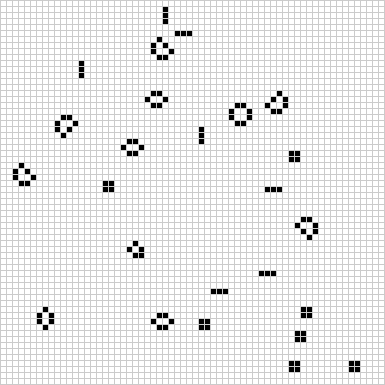

# [Rust 🦀 and WebAssembly 🕸](https://rustwasm.github.io/docs/book/introduction.html)  
Result of tutorial tasks: wasm-game-of-life

Started with:  

cargo generate --git https://github.com/rustwasm/wasm-pack-template

Completed with:  

